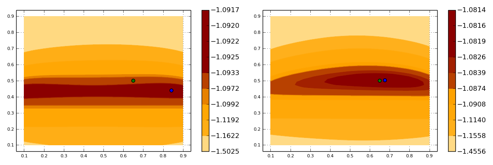

# DynamicDiscreteModels.jl

Back-end support for doing statistical inference with any model that can described as a "partially observed" (discrete) Markov chain, such as a Hidden Markov Model.

Model construction and data simulation:

~~~julia
julia> #use a constructor defined in a front-end package:
julia> model=myawesomemodel()
julia> coef!(model,trueparameter)
julia> #or simply:
julia> model=myawesomemodel(trueparameter)
julia> #generate data from the model:
julia> data=rand(model,1000);         #1 time series with 1000 observations
julia> data=rand(model,100,10);       #10 time series with 100 observations each
julia> data=rand(model,[100,120,115]);    #3 time series with 100, 120 and 115 obs.
~~~

Parameter estimation:

~~~julia
julia> #plain maximum likelihood:
julia> thetahat=mle(model,data)
julia> #maximum likelihood via EM algorithm:
julia> thetahat=em(model,data)
~~~

Hidden state inference (Viterbi filtering):
~~~julia
julia> #pretend thetahat is the "true" parameter:
julia> coef!(model,thetahat)
julia> #most likely path of latent states:
julia> viterbi(model,data)
~~~

## Scope of the package and role of front-end packages

The scope of the package includes:

- filter/smoother algorithms (aka. forward/backward)
- parameter estimation: maximum likelihood and EM algorithm
- hidden state inference: Viterbi filtering
- support for deep modelling of the transition matrices
- support for sparse transition matrices
- support for Jacobians in all of the above

In practice [DynamicDiscreteModels.jl](https://github.com/BenConnault/DynamicDiscreteModels.jl) implements:

- some core methods: `rand()`, `loglikelihood()`, `estep()` and `viterbi()`.
- convenience methods: `em()` wraps `estep()` with generic M-step numerical optimizations. [DynamicDiscreteModels.jl](https://github.com/BenConnault/DynamicDiscreteModels.jl) also inherits `mle()` from `StatisticalModels`, which wraps `loglikelihood()` with generic numerical optimization.

The job of a front-end package [MyModel.jl](http://imgc.allpostersimages.com/images/P-473-488-90/56/5632/N32MG00Z/posters/h-armstrong-roberts-mad-scientist-in-laboratory-mixing-chemicals.jpg) is simply to specify `coef!(mymodel,myparameter)` which maps `myparameter` to [DynamicDiscreteModels.jl](https://github.com/BenConnault/DynamicDiscreteModels.jl)'s canonical representation. All of the above methods will then be available. Optionally, a front-end package may also extend `em()` and/or `mle()` with specialized optimization wrapping [DynamicDiscreteModels.jl](https://github.com/BenConnault/DynamicDiscreteModels.jl)'s `estep()` and `loglikelihood()`.

See **Usage** below for a simple example and see [HiddenMarkovModels.jl](https://github.com/BenConnault/HiddenMarkovModels.jl) for an actual front-end package built on top of [DynamicDiscreteModels.jl](https://github.com/BenConnault/DynamicDiscreteModels.jl).

## Installation

~~~julia
julia> Pkg.add("DynamicDiscreteModels")
~~~

## Usage

For the purpose of this package, a "dynamic discrete model" is a discrete Markov chain z=(x,y), where x=1...dx is latent and y=1...dy is observed. The package defines an abstract type `DynamicDiscreteModel` with two fields:

- `m` is a (dx,dy,dx,dy) array that holds the Markov probabilities m[x,y,x',y'] of moving from (x,y) today to (x',y') tomorrow.
- `mu` is a (dx,dy) array that holds the joint initial distribution of the chain.

Any front-end implementation of a `DynamicDiscreteModel` will specify a mapping from a statistical parameter θ to the transition matrix `m` in a `coef!(model,parameter)` function. Being a back-end package, `DynamicDiscreteModels.jl` is agnostic as to the specific mapping, but [examples/toymodel.jl](examples/toymodel.jl) provides a simple example. In this example (x,y) is a Hidden Markov model where x moves from today to tomorrow according to the Markov transition matrix A(θ) and y is drawn conditional on x according to the emission/transition matrix B(θ):

~~~
.
       [ θ₁     1-θ₁ ]           [θ₂          (1-θ₂)/2   (1-θ₂)/2  ]
A(θ) = [ 1-θ₁   θ₁   ]    B(θ) = [(1-θ₂)/2    (1-θ₂)/2   θ₂        ]
~~~    

The statistical parameter θ is of dimension 2, x can take values 1, 2 and y can take values 1, 2, 3. Here is the code defining a toy model:

~~~julia
importall DynamicDiscreteModels

type ToyModel <: DynamicDiscreteModel

	#DynamicDiscreteModel fields
	m::Array{Float64,4}			  	#the transition matrix given as m[x,y,x',y']
	mu::Array{Float64,2}  			#initial distribution (dx,dy)

	#DynamicDiscreteModel's technical fields
	rho::Array{Float64,1}
	phi::Array{Float64,1}
	psi::Array{Float64,1}
end

dx,dy=2,3

toymodel()=ToyModel(
  Array(Float64,dx,dy,dx,dy),
  fill(1/6,2,3),
  Array(Float64,1),
  Array(Float64,dx),
  Array(Float64,dx))

function coef!(model::ToyModel,theta::Tuple)
	p1,p2=theta[1],theta[2]
	a=[p1 1-p1;1-p1 p1]
	p3=(1-p2)/2
	b=[p2 p3 p3; p3 p3 p2]
  #a convenience function is provided for calibrating models with hidden Markov structure
	hmm2ddm!(model,a,b)         
end
~~~

We can initiate a toy model, calibrate it to a true parameter value θ*=(.65,.5), and simulate 100 time series of length 100:

~~~julia
julia> thetastar=(.65, .5);
julia> model=toymodel();
julia> coef!(model,thetastar);
julia> data=simulate(model,100,100);
julia> data[1]
100-element Array{Int64,1}:
 1
 3
 1
 1
 2
 3
 ...
~~~

With the model and some data, we can find the most likely parameter value behind the data, according to the model, by computing the maximum likelihood estimator. Two methods are available: direct numerical optimization of the log-likelihood via `mle()` and the EM algorithm via `em()`. To help the optimizer, it is a good idea to first reparametrize the model on R rather than on [0,1]:

~~~julia
theta2eta(theta::Tuple)=[log(theta[1]/(1-theta[1])),log(theta[2]/(1-theta[2]))]
eta2theta(eta::Array)=(exp(eta[1])/(1+exp(eta[1])),exp(eta[2])/(1+exp(eta[2])))
coef!(model::ToyModel,eta::Array)=calibrate!(model,eta2theta(eta))
~~~

Notice how `coef!()` will use multiple dispatch to choose between the `eta` and `theta` parametrizations. `mle()` and `em()` will dispatch on `parameter::Array` by default so keep this signature for a parametrization which plays nicely with numerical optimization.

We then simply call:

~~~julia
julia> thetahat=eta2theta(mle(model,data))
(0.6762467624375702,0.5026000995341361)
julia> thetahat2=eta2theta(em(model,data))
(0.6763156818261421,0.5025930701695173)
~~~

Good news, up to some numerical precision error, `mle()` and `em()` agree on the maximum of the likelihood function. It also turns out that with this sample size, we can pinpoint the true parameter value (0.65,0.5) rather well. This is not the case with a smaller sample size:

~~~julia
julia> thetahat3=eta2theta(mle(model,data[1:10]))
(0.8420953672648955,0.4391327611992014)
~~~

Here is a plot of the likelihood surface using 10 and 100 time series, along with their maximums `thetahat` and `thetahat3` computed above (in blue) and the true parameter value (in green):

(See [examples/toymodel.jl](examples/toymodel.jl) for the code used generate the picture.)
